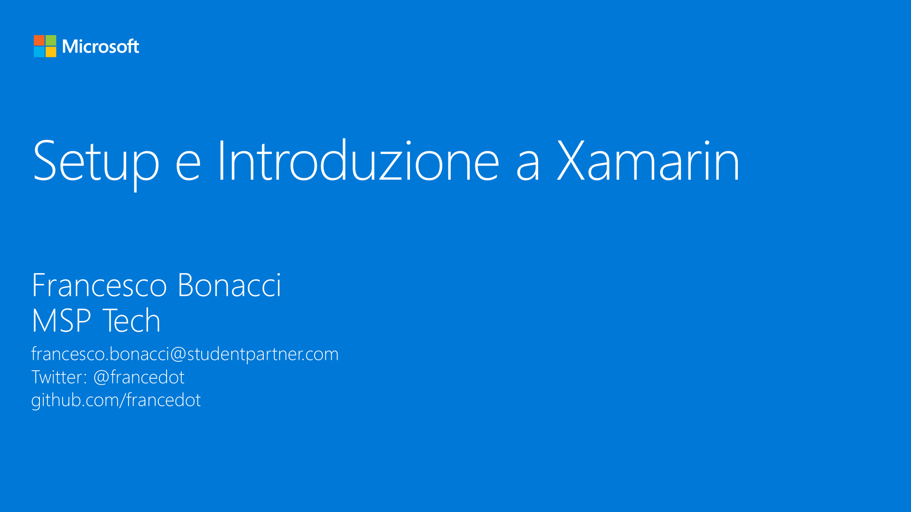

# M1 - Setup e Introduzione a Xamarin

_In questo modulo iniziale scopriremo che cos'è e come funziona Xamarin, quali strumenti ci mette a disposizione e configureremo il nostro sistema in modo da essere pronti per sviluppare la prima applicazione cross-platform._

#### Speaker: Francesco Bonacci, MSP Tech
#### Twitter: @francedot | Email: francesco.bonacci@studentpartner.com
[Serie su Channel9](https://channel9.msdn.com/Series/Xamarin-per-principianti/)

