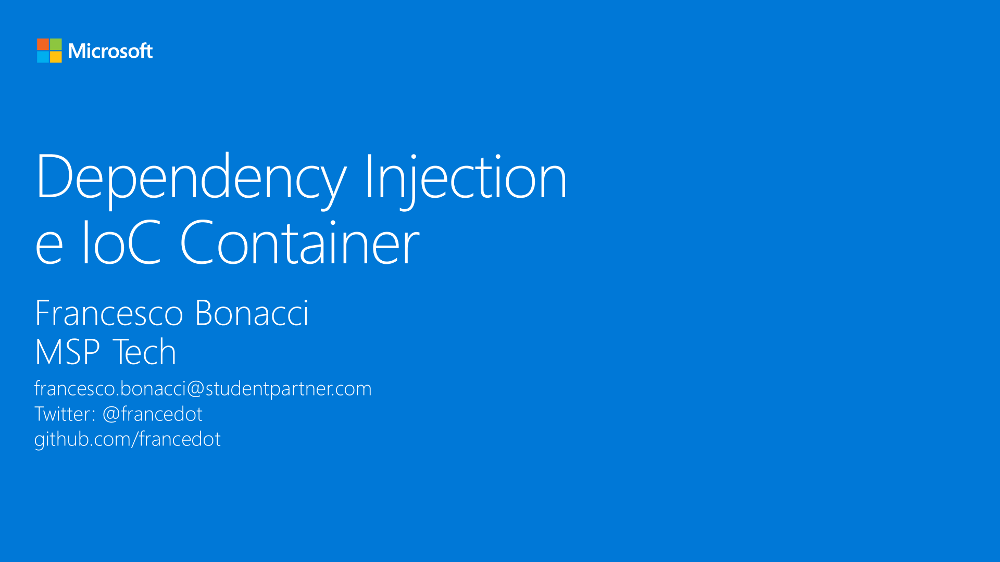

# M12 - Dependency Injection e IoC Container

_Progettare un’applicazione cross-platform può portare all’instaurarsi di dipendenze tra componenti che influiscono sulla portabilità e testabilità del codice. In questo modulo vedremo come usare a nostro vantaggio il design pattern Dependency Injection (DI) per creare e registrare componenti “loosely coupled” all’interno di un Inversion of Control Container. Introdurremo infine alcuni Container integrati in framework di terze parti utili a gestire il ciclo di vita dei componenti all’interno dell’applicazione._

#### Speaker: Francesco Bonacci, MSP Tech
#### Twitter: @francedot | Email: francesco.bonacci@studentpartner.com
[Serie su Channel9](https://channel9.msdn.com/Series/Xamarin-per-principianti/)

