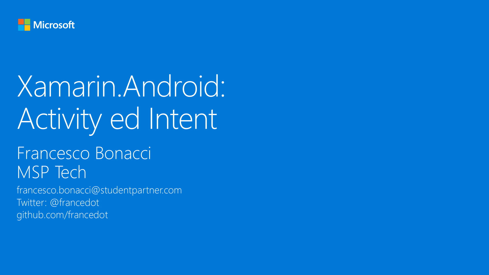

# M3 - Xamarin.Android: Activity ed Intent

_Sviluppare un’applicazione multi-finestra richiede la conoscenza di alcuni aspetti fondamentali della navigazione in Android. In questo modulo descriveremo i concetti di Context, Activity ed Intent esplicito e implicito._

#### Speaker: Francesco Bonacci, MSP Tech
#### Twitter: @francedot | Email: francesco.bonacci@studentpartner.com
[Serie su Channel9](https://channel9.msdn.com/Series/Xamarin-per-principianti/)

