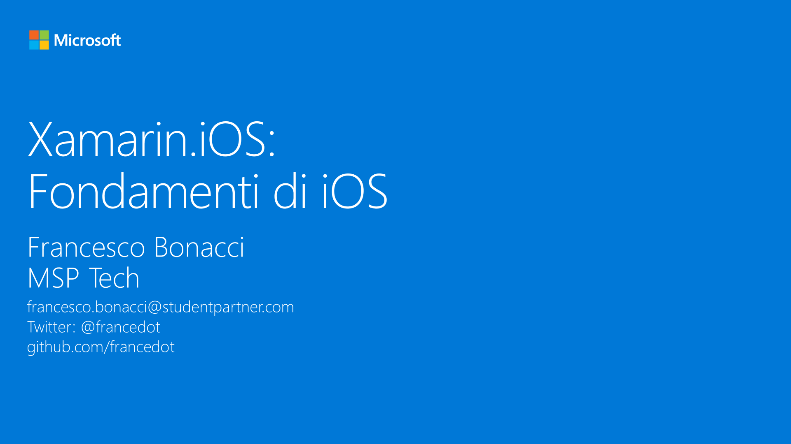

# M4 - Xamarin.iOS: Fondamenti di iOS

_In questo modulo vedremo come utilizzare l’approccio classico di Xamarin per sviluppare un’applicazione iOS. Per fare questo occorrerà richiamare alcune caratteristiche base della piattaforma iOS e spiegare come alcuni di questi concetti vengano riadattati in Xamarin._

#### Speaker: Francesco Bonacci, MSP Tech
#### Twitter: @francedot | Email: francesco.bonacci@studentpartner.com
[Serie su Channel9](https://channel9.msdn.com/Series/Xamarin-per-principianti/)

