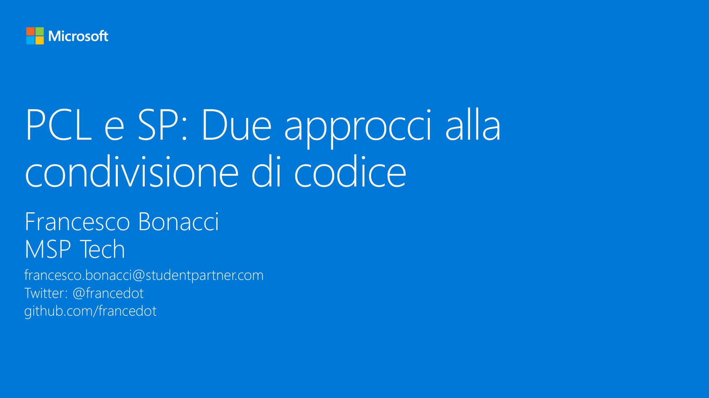

# M6 - PCL e SP: Due approcci alla condivisione di codice

_In questo modulo vedremo come condividere tramite Portable Class Library (PCL) e Shared Project (SP) la parte di codice riguardante la logica di business e accesso ai dati dell’applicazione. Illustreremo inoltre quali sono i casi d’uso e vantaggi e svantaggi di ognuno dei due approcci._

#### Speaker: Francesco Bonacci, MSP Tech
#### Twitter: @francedot | Email: francesco.bonacci@studentpartner.com
[Serie su Channel9](https://channel9.msdn.com/Series/Xamarin-per-principianti/)

