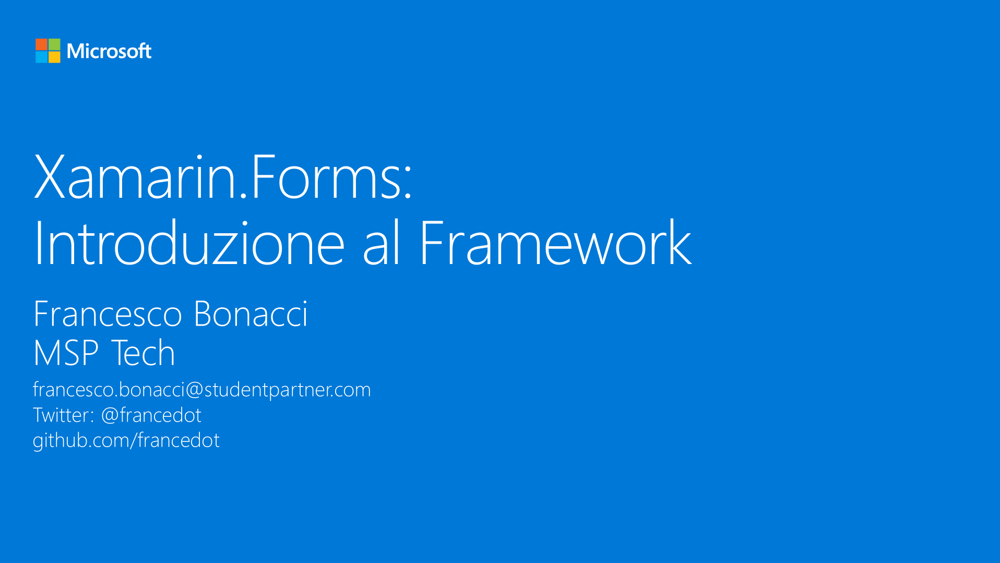

# M7 - Xamarin.Forms: Introduzione al Framework

_Il progetto di un’applicazione Xamarin.Forms consente di svincolarsi da alcuni vincoli di progetto legati alle piattaforme native permettendo non solo di condividere codice relativo alla logica di business ma anche quello relativo alla UI. In questo modulo descriveremo la tipica struttura di un progetto Xamarin.Forms con alcuni componenti fondamentali come Page, View e Layout e svilupperemo una semplice User Interface via codice._

#### Speaker: Francesco Bonacci, MSP Tech
#### Twitter: @francedot | Email: francesco.bonacci@studentpartner.com
[Serie su Channel9](https://channel9.msdn.com/Series/Xamarin-per-principianti/)

