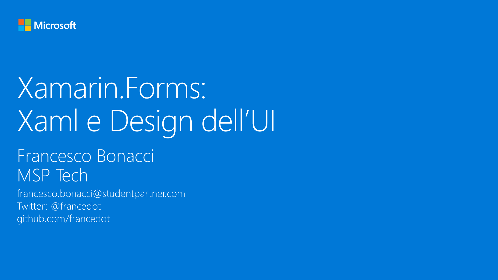

# M6 - PCL e SP: Due approcci alla condivisione di codice

_In questo modulo sfrutteremo le potenzialità dello Xaml di Xamarin.Forms per creare componenti riutilizzabili tra diverse pagine dell’applicazione. Vedremo inoltre come dichiarare staticamente e dinamicamente risorse a livello di pagina e applicazione ed infine definiremo i concetti di stile implicito ed esplicito._

#### Speaker: Francesco Bonacci, MSP Tech
#### Twitter: @francedot | Email: francesco.bonacci@studentpartner.com
[Serie su Channel9](https://channel9.msdn.com/Series/Xamarin-per-principianti/)

